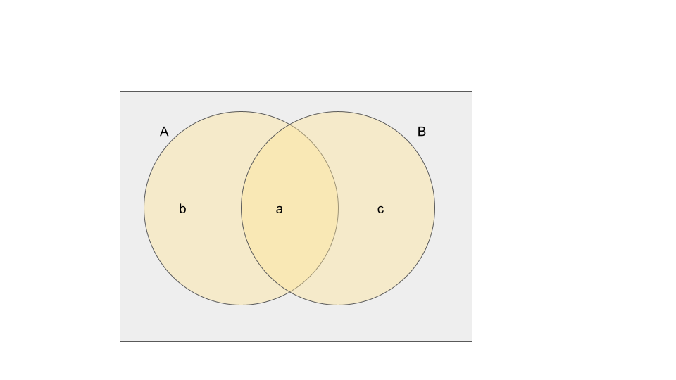

```{r setup, include=FALSE}
knitr::opts_chunk$set(echo = TRUE)
```


```{r message=FALSE, warning=FALSE, include=FALSE}
install.packages("blogdown")
```


## 2.1 Introduction

**Classical Probability Concept** - If there are \(N\) equally likely possibilities, of which one must occur and \(n\) are regarded as favorable, or as a "success" then the probability of a "success" is given by the ratio \(\frac{n}{N}\)

**Frequency Interpretation** - The probability of an event (outcome or happening) is the proportion of the time that events of the same kind will occur in the long run

**Axiomatic Approach** - Probabilities are defined as "mathematical objects" that behave according to certain well-defined rules

## 2.2 Sample Spaces

**Experiment** - Any process of observation or measurement

**Outcome** - The results one obtains from an experiment

**Sample Space** - The set of all possible outcomes of an experiment; usually denoted by the letter \(S\). 

**Element** or **Sample Point** - Each outcome in a sample space

**Finite Set** -  A set that has a finite number of elements; Informally, a finite set is a set which one could in principle count and finish counting

**Countable Set** - a set that has the same cardinality (the number of elements of the set) as some subset of the set of natural numbers \(\mathbb{N}=\{0,1,2,3,\ldots\}\); it could be finite, or infinite

**Discrete Set** - Sample space contains a finite number of elements or an infinite though countable number of elements

**Continuous Set** - when a sample space consists of a continuum, such as all the points of a line segment or all the points in a plane; generally the result of measurement of physical properties


## 2.3 Events

**Event** - is a subset of a sample space

If \(A\) and \(B\) are any two subsets of a sample space \(S\), then:

- **\(A \cup B\)** or the Union of \(A\) and \(B\) - the subset of \(S\) that contains all the elements that are either in \(A\), in \(B\), or in both
- **\(A \cap B\)** or the Intersection of \(A\) and \(B\) - the subset of \(S\) that contains all the elements that are in both \(A\) and \(B\)
- **\(A^\complement\)** or the complement of \(A\) is the subset of \(S\) that contains all the elements of \(S\) that are not in \(A\)
- **\(A \subset B\)** - \(A\) is contained in \(B\)

**Mutually Exclusive** - Two events having no elements in common; written as \(A \cap B = \emptyset\)

**De Morgan Laws** 
- \((A \cap B)^\complement = A^\complement \cup B^\complement \)
- \((A \cup B)^\complement = A^\complement \cap B^\complement \)

## 2.4 Probability of an Event

**\(P(A)\)** - Probability of event \(A\)

Following postulates of probability apply only to discrete sample spaces \(S\):

- **Postulate 1** - The probability of an event is a nonnegative real number; that is, \(P(A) \ge 0\) for any subset \(A\) of \(S\)
- **Postulate 2** - \(P(S)=1\)
- **Postulate 3** - If \(A_1, A_2, A_3, \ldots, \) is a finite or infinite sequence of mutually exclusive events of \(S\), then 

\[P(A_1 \cup A_2 \cup A_3 \cup \cdots) = P(A_1) + P(A_2) + P(A_3) + \cdots \]

**Theorem 2.1** - If \(A\) is an event in a discrete sample space \(S\), then \(P(A)\) equals the sum of the probabilities of the individual outcomes comprising \(A\).

**Proof** - Let \(O_1, O_2, O_3,\ldots\), be the finite or infinite sequence of outcomes that comprise the event \(A\). Thus,

\[A=O_1 \cup O_2 \cup O_3 \cdots \]

and since the individual outcomes, the \(O\)'s, are mutually exclusive, the third postulate or probability yields

\[P(A)=P(O_1)+P(O_2)+P(O_3)+\cdots \]

This completes the proof.

**Theorem 2.2** - If an experiment can result in any one of \(N\) different equally likely outcomes, and if \(n\) of these outcomes together constitute event \(A\), then the probability of event \(A\) is

\[P(A) = \frac{n}{N}\]

**Proof** - Let \(O_1, O_2, O_3,\ldots,O_N\) represent the individual outcomes in \(S\), each with probability \(\frac{1}{N}\). If \(A\) is the union of \(n\) of these mutually exclusive outcomes, and it does not matter which ones, then

\[
\begin{align}
P(A)&=P(O_1 \cup O_2  \cup \cdots \cup O_n)\\
&=P(O_1) + P(O_2) + \cdots + P(O_n)\\
&=\underbrace{\frac{1}{N} + \frac{1}{N} + \cdots + \frac{1}{N}}_{n \, \text{terms}}\\
&=\frac{n}{N}
\end{align}
\]

## 2.5 Some Rules of Probability

**Theorem 2.3** - If \(A\) and \(A^\complement\) are complementary events in a sample space \(S\), then

\[P(A^\complement) = 1 - P(A)\]

**Proof** In the second and third steps of the proof that follows, we make use of the definition of a complement, according to which \(A\) and \(A^\complement\) are mutually exclusive and (\A \cup A^\complement = S \). Thus, we write

\[
\begin{align*}
1 &= P(S) && \text{(by Postulate 2)} \\
&=P(A \cup A^\complement)\\
&=P(A) + P(A^\complement) && \text{(by Postulate 3)}
\end{align*}
\]

and it follows that \(P(A^\complement) = 1 - P(A)\)

**Theorem 2.4** - \(P(\emptyset)=0 \) for any sample space \(S\).

**Proof** Since \(S\) and \(\emptyset\) are mutually exclusive and \(S \cup \emptyset = S\) in accordance with the definition of the empty set \(\emptyset\), it follows that

\[
\begin{align}
P(S) &= P(S \cup \emptyset)\\
&=P(S) + P(\emptyset) && \text{(by Postulate 3)}
\end{align}
\]

and, hence, that \(P(\emptyset)=0\)

**Theorem 2.5** - If \(A\) and \(B\) are events in a sample space \(S\) and \(A \subset B\), then \(P(A) \le P(B)\).

**Proof** Since \(A \subset B\), we can write

\[ B = A \cup (A^\complement \cap B) \]

as can easily be verified by means of a Venn diagram. Then, since \(A\) and \(A^\complement \cap B\) are mutually exclusive, we get

\[
\begin{align}
P(B) &= P(A) + P(A^\complement \cap B) && \text{(by Postulate 3)}\\
& \ge P(A) && \text{(by Postulate 1)}
\end{align}
\]

**Theorem 2.6** - \(0 \le P(A) \le 1\) for any event \(A\).

**Proof** - Using Theorem 2.5 and the fact that \(\emptyset \subset A \subset S\) for any event \(A\) in \(S\), we have 

\[
P(\emptyset) \le P(A) \le P(S)
\]

Then, \(P(\emptyset)=0\) and \(P(S)=1\) leads to the result that 

\[
0 \le P(A) \le 1
\]

**Theorem 2.7** - If \(A\) and \(B\) are any two events in a sample space \(S\), then 

\[
P(A \cup B) = P(A) + P(B) - P(A \cap B)
\]

**Proof** - Assigning the probabilities \(a, b\) and \(c\) to the mutually exclusive events \(A \cap B\), \(A \cap B^\complement \), and \(A^\complement \cap B\) as in the Venn diagram below. We find that:

\[
\begin{align}
P(A \cup B) &= a+b+c\\
&=(a+b)+(c+a)-a\\
&=P(A) + P(B) - P(A \cap B)
\end{align}
\]



**Theorem 2.8** - If \(A\), \(B\), and \(C\) are any three events in a sample space \(S\), then

\[
P(A \cup B \cup C) = P(A) + P(B) + P(C) - P(A \cap B) - P(A \cap C) - P(B \cap C) + P(A \cap B \cap C)
\]

**Proof** - Writing \(A \cup B \cup C \) as \(A \cup (B \cup C) \) and using the formula of Theorem 2.7 twice, once for \(P[A \cup (B \cup C)]\) and once for \(P(B \cup C) \), we get

\[
\begin{align}
P(A \cup B \cup C) &= P[ A \cup (B \cup C)]\\
&= P(A) + P(B \cup C) - P[A \cap (B \cup C)]\\
&= P(A) + P(B) + P(C) - P(B \cup C) - P[A \cap (B \cup C)]
\end{align}
\]

Then, using the distributive law that \(A \cap (B \cup C) = (A \cap B) \cup (A \cap C)\):

\[
\begin{align}
P[A \cap (B \cup C)] &= P[(A \cap B) \cup (A \cap C)] \\
&= P(A \cap B) + P(A \cap C) - P[(A \cap B) \cap (A \cap C)]\\
&= P(A \cap B) + P(A \cap C) - P(A \cap B \cap C)\\
\end{align}
\]

and hence that

\[
P(A \cup B \cup C)= P(A) + P(B) + P(C) - P(A \cap B) - P(A \cap C) - P(B \cap C) + P(A \cap B \cap C)
\]

**Odds** - the ratio of the probability thtat the evenet will occur to the probability that it will not occur, provided neither propability is zero. Odds are generally quoted in terms of positive integers having no common factor: \(p = \frac{A}{A+B}\)

## 2.6 Conditional Probability

**Conditional Probability** - If \(A\) and \(B\) are any two events in a a sample space \(S\) and \(P(A) \ne 0\), then the conditional probability of \(B\) given \(A\) is

\[
P(B|A) = \frac{P(A \cap B)}{P(A)}
\]

**Theorem 2.9 (Multiplication Rule)**- If \(A\) and \(B\) are any two events in a sample space \(S\) and \(P(A)\ne 0\), then
\[
P(A \cap B)=P(A) \cdot P(B|A)
\]

Alternatively if \(P(B)\ne 0\), then
\[
P(A \cap B)=P(B) \cdot P(A|B)
\]

**Multiplication Rule (words)** - The probability that \(A\) and \(B\) will both occur is the product of the probability of \(A\) and the conditional probability of \(B\) given \(A\). 

**Sampling without replacement** - executing multiple experiments back to back where the first set is not replaced before the second set is selected

**Theorem 2.10** - If \(A, B\), and \(C\) are any three events in a sample space \(S\) such that \(P(A \cap B) \ne 0\), then

\[
P(A \cap B \cap C) = P(A) \cdot P(B|A) \cdot P(C|A \cap B)
\]

**Proof** - Writing \(A \cap B \cap C\) as \((A \cap B) \cap C\) and using the formula of Theorem 2.9 twice, we get

\[
\begin{align}
P(A \cap B \cap C) &= P[(A \cap B) \cap C]\\
&= P(A \cap B) \cdot P(C|A \cap B)\\
&= P(A) \cdot P(B|A) \cdot P(C|A \cap B)
\end{align}
\]

## 2.7 Independent Events

**Independence** - Two events \(A\) and \(B\) are **independent** if and only if 

\[
P(A \cap B) = P(A) \cdot P(B)
\]

**Theorem 2.11** - If \(A\) and \(B\) are independent, then 

## 2.8 Bayes Theorem

**Theorem 2.12**

**Theorem 2.13**

## 2.9 Theory in Practice

**Definition 2.7 Reliability** - probability that it will function within specified limits for a specified period of time under specified environmental conditions

**Theorem 2.14** - The **reliability of a series system** consisting of \(n\) independent components is given by 

\[R_s = \prod_{i=1}^n R_i\]

where \(R_i\) is the reliability of the \(i\)th component.

**Proof** The proof follows immediately by iterating in Definition 2.5 - Independence

**Theorem 2.15** - The **reliability of a parallel system** consisting of \(n\) independent components is given by

\[R_p = 1 - \prod^n_{i=1} (1-R_i)\]

**Proof** - the proof of this theorem is identical to that of Theorem 2.14, with \((1 - R_i)\) replacing \(R_i\)