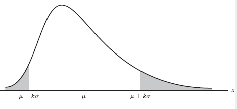

```{r setup, include=FALSE}
knitr::opts_chunk$set(echo = TRUE)
```


```{r message=FALSE, warning=FALSE, include=FALSE}
install.packages("blogdown")
```


## 4.1 Introduction

**Mathematical Expectation** - Idea arising from games; the product of the amount a player stands to win and the probability that he or she will win

## 4.2 The Expected Value of a Random Variable

**Expected Value** - If \(X\) is a discrete random variable and \(f(x)\) is the value of its probability distribution at \(x\), the **expected value of \(X\)** is

\[
E(X)= \underset{x} \sum x \cdot f(x)
\]

Correspondingly, if \(X\) is a continuous random variable and \(f(x)\) is the value of its probability density at \(x\), the **expected value of \(X\)** is

\[
E(X)=\int_{- \infty}^{\infty} x \cdot f(x) dx
\]

**Theorem 4.1 [Expected Value w/ function of X]** - If \(X\) is a discrete random variable and \(f(x)\) is the value of its probability distribution at \(x\), the expected value of \(g(x)\) is given by

\[
E[g(x)]= \underset{x}\sum g(x) \cdot f(x)
\]

Correspondingly, if \(X\) is a continuous random variable and \(f(x)\) is the value of its probability density at \(x\), the expected value of \(g(X)\) is given by

\[
E[g(x)]=\int_{- \infty}^{ \infty } g(x) \cdot f(x) dx
\]

**Theorem 4.1 [Expected Value w/ function of X - Proof]** Since a more general proof is beyond the scope of this text, we shall prove this theorem here only for the case where \(X\) is discrete and has a finite range. Since \(y=g(x)\) does not necessarily define a one-to-one correspondence, suppose that \(g(x)\) takes on the value \(g_i\) when \(x\) takes on the values \(x_{i1},x_{i2},\ldots,x_{in_i}\). Then, the probability that \(g(X)\) will take on the value \(g_i\) is

\[
P[g(X)=g_i] = \sum_{j=1}^{n_i}f(x_{ij})
\]

and if \(g(x)\) takes on the values \(g_1,g_2,\ldots,g_m\), it follows that

\[
\begin{align}
E[g(X)]&= \sum_{i=1}^m g_i \cdot P[g(X)=g_i]\\
&= \sum_{i=1}^m g_i \cdot \sum_{j=1}^{n_i} f(x_{ij})\\
&= \sum_{i=1}^m \sum_{j=1}^{n_i} g_i \cdot f(x_{ij})\\
&= \sum_{x} g(x) \cdot f(x)\\
\end{align}
\]

where the summation extends over all values of \(X\).

**Theorem 4.2 [Expected Value coefficient and sum of constants]** - If \(a\) and \(b\) are constants, then 

\[
E(aX + b)=aE(X)+b
\]

**Theorem 4.2 [Expected Value coefficient and sum of constants - Proof]** Using Theorem 4.1 with \(g(X)=aX+b\), we get

\[
\begin{align}
E(aX+b)&=\int_{-\infty}^{\infty}(ax+b) \cdot f(x) dx\\
&=a \int_{-\infty}^{\infty}x \cdot f(x)dx+b \int_{-\infty}^{\infty}f(x)dx\\
&=aE(X)+b
\end{align}
\]

**Corollary 4.1** - If \(a\) is a constant, then
\[
E(aX)=aE(X)
\]

**Corollary 4.2** - If \(b\) is a constant, then
\[
E(b)=b
\]

**Theorem 4.3 [Expected values for Summation]** - If \(c_1, c_2, \ldots , c_n\) are constants, then 

\[
E \left [ \sum_{i=1}^n c_i g_i(X) \right ] = \sum_{i=1}^n c_i E[g_i(X)]
\]

**Theorem 4.3 [Expected values for Summation - Proof]** According to Theorem 4.1 with \(g(X)=\sum_{i=1}^{n} c_i g_i (X)\), we get

\[
\begin{align}
E \left [ \sum_{i=1}^n c_i g_i(X) \right ] &= \sum_x \left [ \sum_{i=1}^n c_i g_i(x) \right ] f(x)\\
&= \sum_{i=1}^n \sum_x c_i g_i(x)f(x)\\
&= \sum_{i=1}^n c_i \sum_x g_i(x)f(x)\\
&= \sum_{i=1}^n c_i E[g_i(X) ] \\
\end{align}
\]

**Theorem 4.4 [Expected Value for Joint Probability]** - If \(X\) and \(Y\) are discrete random variables and \(f(x,y)\) is the value of their joint probability distribution at \((x,y)\), the expected value of \(g(X,Y)\) is

\[
E[g(X,Y)] = \sum_x \sum_y g(x,y) \cdot f(x,y)
\]

Correspondingly, if \(X\) and \(Y\) are continuous random variables and \(f(x,y)\) is the value of their joint probability density at \((x,y)\), the expected value of \(g(X,Y)\) is

\[
E[g(x,y)] = \int_{-\infty}^{\infty} \int_{-\infty}^{\infty} g(x,y) f(x,y) dx dy
\]

**Theorem 4.5 [Expected values for Summation (multiple random variables)]** - If \(c_1, c_2, \ldots , c_n\) are constants, then 

\[
E \left [ \sum_{i=1}^n c_i g_i (X_1, X_2, \ldots, X_k)\right ] = \sum_{i=1}^n c_i E[g_i(X_1, X_2, \ldots, X_k)]
\]


## 4.3 Moments

**Moments About the Origin** - The **\(r\)th moment about the origin** of a random variable \(X\), denoted by \(\mu_r^{'}\), is the expected value of \(X^{'}\); symbolically

\[
\mu_r^{'} = E(X^r)=\sum_x x^r \cdot f(x)
\]

for \(r=0,1,2,\ldots\) when \(X\) is discrete, and

\[
\mu_r^{'}=E(X^r)=\int_{- \infty}^{\infty} x^r \cdot f(x) dx
\]

when \(X\) is continuous

**Mean of a Distribution** - \(\mu_1^{'}\) is called the **mean** of the distribution of \(X\), or simply the **mean of \(X\)**, and it is denoted simply by \(\mu\)

**Moments about the Mean** - The **\(r\)th moment about the mean** of a random variable \(X\), denoted by \(\mu_r\), is the expected value of \((X-\mu)^r\), symbolically

\[
\mu_r = E[(X-\mu)^r]=\sum_x (x-\mu)^r \cdot f(x)
\]

for \(r=0,1,2,\ldots\) when \(X\) is discrete, and

\[
\mu_r=E[(X-\mu)^r]=\int_{- \infty}^{\infty} (x-\mu)^r \cdot f(x) dx
\]

when \(X\) is continuous

**Variance** - \(\mu_2\) is called the **variance** of the distribution of \(X\), or simply the **variance of \(X\)**, and is denoted by \(\sigma^2, \, \sigma_x^2, \, var(X)\) or \(V(X)\). The positive square root of the variance, \(\sigma\), is call the **standard deviation of \(X\)**

**Theorem 4.6 [Variance]**

\[
\sigma^2 = \mu_2^{'}-\mu^2
\]

**Proof**

\[
\begin{align}
\sigma^2 &= E[(X-\mu)^2]\\
&=E(X^2-2 \mu X+\mu^2)\\
&=E(X^2)-2 \mu E(X)+E(\mu^2)\\
&=E(X^2)-2 \mu \cdot \mu+\mu^2\\
&= \mu_2'-\mu^2
\end{align}
\]

**Theorem 4.7 [Coefficients and sums for variance]** - If \(X\) has the variance \(\sigma^2\), then

\[
\text{var}(aX+b)= a^2 \sigma^2
\]

## 4.4 Chebyshev's Theorem

**Theorem 4.8** or **Chebyshev's Theorem** - If \(\mu\) and \(\sigma\) are the mean and the standard deviation of a random variable \(X\), then for any positive constant \(k\) the probability is _at least_ \(1 - \frac{1}{k^2}\) that \(X\) will take on a value within \(k\) standard deviationes fo the mean; symbolically,

\[
P(|x-\mu|< k \sigma) \ge 1- \frac{1}{k^2}, \; \sigma \ne 0
\]

**Proof** According to _Moments about the mean_ and _Variance_, we write

\[
\sigma^2 = E[(X-\mu)^2] = \int_{-\infty}^{\infty}(x-\mu)^2 \cdot f(x) dx
\]




Then, dividing the integral into three parts as shown in Figure 4.2, we get

\[
\sigma^2 = \int_{- \infty}^{\mu - k \sigma}(x - \mu)^2 \cdot f(x) dx +
\int_{\mu - k \sigma}^{\mu + k \sigma}(x - \mu)^2 \cdot f(x) dx +
\int_{\mu + k \sigma}^{\infty}(x - \mu)^2 \cdot f(x) dx
\]

Since the integrand \((x - \mu)^2 \cdot f(x) \) is nonnegative, we can form the inequality

\[
\sigma^2 \ge \int_{- \infty}^{\mu - k \sigma}(x - \mu)^2 \cdot f(x) dx +
\int_{\mu + k \sigma}^{\infty}(x - \mu)^2 \cdot f(x) dx
\]

by deleting the second integral. Therefore, since \((x-\mu)^2 \ge k^2 \sigma ^2\) for \(x \le \mu - k\sigma \) or \(x \ge \mu + k \sigma \) it follows that

\[
\sigma^2 \ge \int_{- \infty}^{\mu - k \sigma} k^2 \sigma^2 \cdot f(x) dx +
\int_{\mu + k \sigma}^{\infty}k^2 \sigma^2 \cdot f(x) dx
\]

and hence that

\[
\frac{1}{k^2} \ge \int_{- \infty}^{\mu -k \sigma} f(x) dx +
\int_{\mu + k \sigma}^{\infty} f(x) dx
\]

provided \(\sigma^2 \ne 0\). Since the sum of the two integrals on the right-hand side is the probability that \(X\) will take on a value less than or equal to \(\mu - k \sigma \) or greater than or equal to \( \mu +k \sigma\), we have thus shown that 

\[
P(|X-\mu| \ge k \sigma) \le \frac{1}{k^2}
\]

and it follows that

\[
P(|X-\mu| \lt k \sigma) \ge 1 - \frac{1}{k^2}
\]

## 4.5 Moment-Generating Functions

**Moment Generating Function** - The **moment generating function** of a random variable \(X\), where it exists, is given by

\[
M_X(t)= E(e^{tX}) = \sum_x e^{tX} \cdot f(x)
\]

when \(X\) is discrete, and 

\[
M_X(t)= E(e^{tX}) = \int_{- \infty}^{\infty}e^{tx} \cdot f(x) dx
\]

when \(X\) is continuous

**Theorem 4.9 [Derivative of Moment Generating Function]** - 

\[
\frac{d^r M_X(t)}{dt^r} \Bigg \vert _{t=0}=\mu_r^{'}
\]

**Theorem 4.10[Moment Generating Function - Utilize Constants]** - If \(a\) and \(b\) are constants, then:

  1. \( M_{X+a}(t) = E [e^{(X + a)t}] = e^{at} \cdot M_X (t)\)
  2. \( M_{bX}(t) = E (e^{bXt}) = M_X (bt)\)
  3. \( M_{\frac{X+a}{b}}(t) = E [e^{(\frac{X + a}{b})t}] = e^{\frac{a}{b}t} \cdot M_X (\frac{t}{b})\)

## 4.6 Product Moments

**Product Moments About the Origin** - The **\(r\)th and \(s\)th product moment about the origin** of the random variables \(X\) and \(Y\), denoted by \(\mu^{'}_{r,s}\), is the expected value of \(X^r Y^s\); symbolically,

\[
\mu^{'}_{r,s}= E(X^r Y^s)=\sum_x \sum_y x^r y^s \cdot f(x,y)
\]

for \(r=0,1,2, \ldots \) and \(s=0,1,2,\ldots\) when \(X\) and \(Y\) are discrete, and

\[
\mu^{'}_{r,s}= E(X^r Y^s)=\int_{- \infty}^{\infty} \int_{- \infty}^{\infty} x^r y^s \cdot f(x,y) dx dy
\]

when \(X\) and \(Y\) are continuous

**Product Moments About the Mean** - The **\(r\)th and \(s\)th product moment about the means** of the random variables \(X\) and \(Y\), denoted by \(\mu_{r,s}\), is the expected value of \((X-\mu_X)^r (Y - \mu_Y)^s\); symbolically,

\[
\begin{align}
\mu_{r,s} &= E[(X- \mu_X)^r (Y - \mu_Y)^s)]\\
&=\sum_x \sum_y (x - \mu_X)^r (y - \mu_Y)^s \cdot f(x,y)
\end{align}
\]

for \(r=0,1,2, \ldots \) and \(s=0,1,2,\ldots\) when \(X\) and \(Y\) are discrete, and


\[
\begin{align}
\mu_{r,s} &= E[(X- \mu_X)^r (Y - \mu_Y)^s)]\\
&= \int_{- \infty}^{\infty} \int_{- \infty}^{\infty} (x - \mu_X)^r (y - \mu_Y)^s \cdot f(x,y)
\end{align}
\]

when \(X\) and \(Y\) are continuous

**Covariance** - \(\mu_{1,1}\) is called the **covaraince** of \(X\) and \(Y\), and it is denoted by \(\sigma_{XY}\), cov(\(X,Y\)), or C(\(X,Y\))

**Theorem 4.11 [Covariance]** - 

\[
\sigma_{XY} = \mu_{1,1}^{'}-\mu_{X} \mu_{Y}
\]

**Proof** - Using the various theorems about expected values, we can write

\[
\begin{align}
\sigma_{XY} &= E[(X-\mu_X)(Y-\mu_Y)]\\
&=E(XY-X \mu_Y - Y \mu_X - \mu_X \mu_Y)\\
&=E(XY) - \mu_Y E(X)-\mu_X E(Y) +\mu_X \mu_Y\\
&=E(XY) - \mu_Y \mu_X-\mu_X \mu_Y  +\mu_X \mu_Y\\
&=\mu_{1,1}^{'}-\mu_{X} \mu_{Y}\\
\end{align}
\]

**Theorem 4.12[Covariance of Independents]** - If \(X\) and \(Y\) are independent, then \(E(XY)= E(X) \cdot E(Y)\) and \(\sigma_{XY} =0 \)

**Proof** For the discrete case we have, by definiteion, 

\[
E(XY)=\sum_x \sum_y xy \cdot f(x,y)
\]

Since \(X\) and \(Y\) are independent, we can write \(f(x,y)=g(x)\cdot h(y)\), where \(g(x)\) and \(h(y)\) are the values of the marginal distributions of \(X\) and \(Y\), and we get

\[
\begin{align}
E(XY)&=\sum_x \sum_y xy \cdot g(x) h(y)\\
&=\left [ \sum_x x \cdot g(x) \right ]\left [ \sum_y y \cdot h(y) \right ]\\
&= E(X) \cdot E(Y)
\end{align}
\]

Hence,

\[
\begin{align}
\sigma_{XY} &= \mu_{1,1}^{'}-\mu_{X} \mu_{Y}\\
&=E(X) \cdot E(Y) - E(X) \cdot E(Y)\\
&=0
\end{align}
\]

**Theorem 4.13[Product Moments of Many Independent Random Variables]** - If \(X_1, X_2,\ldots,X_n\) are independent, then 

\[
E(X_1, X_2,\ldots,X_n)=E(X_1)\cdot E(X_2) \cdot \ldots \cdot E(X_n)
\]

## 4.7 Moments of Linear Combinations of Random Variables

**Theorem 4.14[Mean and Variance of a Linear Combination of \(n\) Random Variables]** - If \(X_1, X_2,\ldots,X_n\) are random variables and 

\[
Y = \sum_{i=1}^n a_i X_i
\]

where \(a_1, a_2, \ldots, a_n\) are constants, then 

\[
E(Y) = \sum_{i=1}^n a_i E(X_i)
\]

and

\[
\text{var}(Y)=\sum_{i=1}^n a_i^2 \cdot \text{var}(X_i)+ 2 \underset{i \lt j}{\sum \sum} a_i a_j \cdot \text{cov} (X_i X_j)
\]

where the double summation extends over all values of \(i\) and \(j\), from 1 to \(n\), for which \(i \lt j\).

**Proof** From **variance** with \(g_i (X_1, X_2, \ldots, X_k)=X_i\) for \(i=0,1,2, \ldots n \) it follows that immediately that

\[
E(Y)=E \left ( \sum_{i=1}^n a_iX_i \right ) = \sum_{i=1}^n a_i E(X_i)
\]

and this proves the first part of the theorem. To obtain the expression for the variance of \(Y\), let us write \( \mu_i \) for \(E(X_i)\) so that we get

\[
\begin{align}
\text{var}(Y) = E([Y-E(Y)]^2)&=E \left \{  \left [ \sum_{i=1}^n a_i X_i  - \sum_{i=1}^n a_i E(X_i)\right ]^2 \right \}\\
&=E \left \{  \left [ \sum_{i=1}^n a_i (X_i  - \mu_i)\right ]^2 \right \}
\end{align}
\]

Then, expanding by means of the multinomial theorem, according to which \((a+b+c+d)^2\), for example, equals \(a^2+b^2+c^c+d^2+2ab+2ac+2ad+2bc+2bd+2cd\), and again referring to Theorem 4.5, we get

\[
\begin{align}
\text{var}(Y) &= \sum_{i=1}^n a_i^2 E[(X_i - \mu_i)^2]+ 2 \underset{i<j}{\sum \sum}a_i a_j E[(X_i - \mu_i)(X_j - \mu_j)]\\
&= \sum_{i=1}^n a_i^2 \cdot \text{var} (X_i)+ 2 \underset{i<j}{\sum \sum}a_i a_j \cdot \text{cov}(X_i,X_j)\\
\end{align}
\]

Note that we have tacitly made use of the fact that \(\text{cov}(X_i, X_j)=\text{cov}(X_j,X_i)\)

**Corollary 4.3** - If the random variables \(X_1, X_2,\ldots,X_n\) are independent and \(Y=\sum_{i=1}^n a_i X_i\), then

\[
\text{var}(Y)=\sum_{i=1}^n a_i^2 \cdot \text{var}(X_i)
\]

**Theorem 4.15[Covariance of Two Linear Combinations of \(n\) Random Variables]** - If \(X_1, X_2,\ldots,X_n\) are random variables and

\[
\begin{align}
Y_1=\sum_{i=1}^n a_i X_i \; \text{and} \; Y_2=\sum_{i=1}^n b_i X_i
\end{align}
\]

where \(a_1,a_2,\ldots,a_n,b_1, b_2, \ldots, b_n\) are constants, then

\[
\begin{align}
\text{cov}(Y_1,Y_2) = \sum_{i=1}^n a_i b_i \cdot \text{var} (X_i)+ \underset{i<j}{\sum \sum}(a_i b_j + a_j b_i) \cdot \text{cov}(X_i,X_j)\\
\end{align}
\]

**Corollary 4.4** - If the random variables \(X_1, X_2,\ldots,X_n\) are independent, \(Y_1=\sum_{i=1}^n a_i X_i\) and \(Y_2=\sum_{i=1}^n b_i X_i\) then

\[
\text{cov}(Y_1, Y_2)=\sum_{i=1}^n a_i b_i \cdot \text{var}(X_i)
\]

## 4.8 Conditional Expectations

**Conditional Expectation** - If \(X\) is a discrete random variable, and \(f(x|y)\) is the value of the conditional probability distribution of \(X\) give \(Y=y\) at \(x\), the **conditioanl expectation of \(u(X)\) given \(Y=y\) is

\[
E[(u(X)|y)]=\sum_x u(x)\cdot f(x|y)
\]

Correspondingly, if \(X\) is a continuous variable and \(f(x|y)\) is the value of the conditional probability distribution of \(X\) given \(Y=y\) at \(x\), the **conditional expectation of \(u(X)\) given \(Y=y\)** is

\[
E[(u(X)|y)]=\int_{- \infty}^{\infty} u(x)\cdot f(x|y)dx
\]

**Conditional Mean** 

\[
\mu_{X|y}=E(X|y)
\]

**Conditional Variance** - of \(X\) given \(Y=y\)

\[
\begin{align}
\sigma_{X|y}^2&=E[(X - \mu_{X|y})^2|y]\\
&=E(X^2|y)-\mu_{X|y}^2
\end{align}
\]

## 4.9 The Theory in Practice


**Sample Mean** 

\[
\overline{x}=\sum_{i=1}^n \frac{x_i}{n}
\]

**Median** - Arrange the observations in ascending order:

  - if the number of observations \(n\) is odd, then the median is the observation at position \(\frac{n+1}{2}\)
  - if the number of observations \(n\) is even, then the median is the average of the two observations at
  \(\frac{n}{2}\) and \(\frac{n}{2} + 1\)
  
**Sample Standard Deviation** 

\[
s=\sqrt{\frac{\sum_{i=1}^n (x-\overline{x})^2}{n-1}}
\]

but since this requires finding the mean first the following is equivalent, but doesn't require finding the mean

\[
s=\sqrt{\frac{n\sum_{i=1}^n x_i^2-(\sum_{i=1}^n x_i)^2}{n(n-1)}}
\]

**Additional Resources:**

- [Chapter_04_Theorem_Notes.pdf](./files/Chapter_04_Notes.pdf) [(tex)](./files/Chapter_04_Notes.tex)