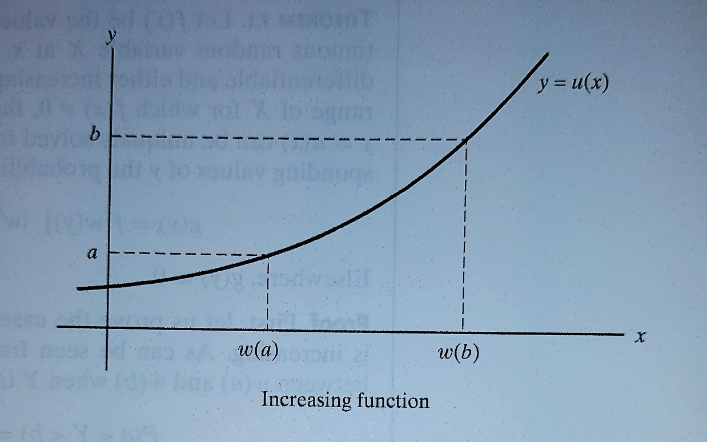

```{r setup, include=FALSE}
knitr::opts_chunk$set(echo = TRUE)
```


```{r message=FALSE, warning=FALSE, include=FALSE}
install.packages("blogdown")
```


## 7.1 Introduction

## 7.2 Distribution Function Technique

## 7.3 Transformation Technique: One Variable

**Theorem 7.1** Let \(f(x)\) be the value of the probability density of the continuous random variable \(X\) at \(x\). If the function given by \(y=u(x)\) is differentiable and either increasing or decreasing for all values within the range of \(X\) for which \(f(x)\ne 0\), then, for these values of \(x\), the equation \(y=u(x)\) can be uniquely solved for \(x\) to give \(x=w(y)\), and for the corresponding values of \(y\) the probability density of \(Y=u(X)\) is given by 

\[
g(y)=f[w(y)] \cdot |w' (y)| \;\; \text{provided } u'(x) \ne 0
\]

Elsewhere, \(g(y)=0\)

**Theorem 7.1 [Proof]** First, let us prove the case where the function given by \(y=u(x)\) is increasing. As can be seen 



\(X\) must take on a value between \(w(a)\) and \(w(b)\) when \(Y\) takes on a value between \(a\) and \(b\). Hence

\[
\begin{align}
P(a \lt Y \lt b ) &= P[w(a) < X < w(b)]\\
&=\int_{w(a)}^{w(b)} f(x) dx\\
&=\int_{a}^{b} f[w(y)]w'(y) dy\\
\end{align}
\]

Where we performed the change of variable \(y=u(x)\), or equivalently \(x=w(y)\), in the integral. In accordance with definition of probability density function the integrand gives the probability density of \(Y\) as long as \(w'(y)\) exists, and we can write 

\[
g(y) = f[w(y)]w'(y)
\]

When the function given by \(y=u(x)\) is decreasing, it can be seen 


that \(X\) must take on a value between \(w(b)\) and \(w(a)\) when \(Y\) takes on a value between \(a\) and \(b\). Hence,

\[
\begin{align}
P(a \lt Y \lt b ) &= P[w(b) < X < w(a)]\\
&=\int_{w(b)}^{w(a)} f(x) dx\\
&=\int_{b}^{a} f[w(y)]w'(y) dy\\
&=-\int_{a}^{b} f[w(y)]w'(y) dy\\
\end{align}
\]

where we performed the same change of variable as before, and it follows that

\[
g(y)=-f[w(y)]w'(y)
\]

Since \(w'(y)= \frac{dx}{dy} = \frac{1}{\frac{dy}{dx}}\) is positive when the function given by \(y=u(x)\) is increasing, and -w'{y} is positive when the function given by \(y=u(x)\) is decreasing, we can combine the two cases by writing 

\[
g(y) = f[w(y)]\cdot|w'(y)|
\]

## 7.4 Transformation Technique: Several Variables

**Theorem 7.2** Let \(f(x_1,x_2)\) be the value of the joint probability density of the continuous random variables \(X_1\) and \(X_2\) at \((x_1, x_2)\). If the functions given by \(y_1=u_1(x_1,x_2)\) and \(y_2=u_2(x_1,x_2)\) are partially differentiable with respect to both \(x_1\) and \(x_2\)and represent a one-to-one transformation for all values within the range \(X_1\) and \(X_2\) for wich \(f(x_1,x_2)\ne0\), then, for these values of \(x_1\) and \(x_2\), the equations \(y_1=u_1(x_1,x_2)\) and \(y_2=u_2(x_1,x_2)\) can be uniquely solved for \(x_1\) and \(x_2\) to give \(x_1=w_1(y_1,y_2)\) and \(x_2=w_2(y_1,y_2)\), and for the corresponding values of \(y_1\) and \(y_2\), the join probability density of \(Y_1=u_1(X_1,X_2)\) and \(Y_2=u_2(X_1,X_2)\) is given by 

\[
g(y_1, y_2) = f[w_1(y_1,y_2),w_2(y_1,y_2)]\cdot |J|
\]

Here, \(J\) called the **Jacobian** of the transformation, is the determinant

\[
J= \left |
\begin{matrix}
\frac{\partial x_1}{\partial y_1} & \frac{\partial x_1}{\partial y_2}\\
\frac{\partial x_2}{\partial y_1} & \frac{\partial x_2}{\partial y_2}\\
\end{matrix}
\right |
\]

Elsewhere, \(g(y_1,y_2) = 0\)

## 7.5 Moment-Generating Function Technique

**Theorem 7.3 [Moment-Generating Function Technique] ** If \(X_1, X_2, \dots,\) and \(X_n\) are independent random variables and \(Y=X_1 + X_2 + \cdots + X_n\), then

\[
M_Y(t) = \prod_{i=1}^n M_{X_i}(t)
\]

where \(M_X(t)\) is the value of the moment-generating function of \(X_i\) at \(t\).

**Theorem 7.3 [Moment-Generating Function Technique - Proof] ** - Making use of the fact that the random variables are independent and hence

\[
f(x_1, x_2,\dots,x_n)=f_1(x_1)\cdot f_2(x_2)\cdot \dots \cdot f_n(x_n)
\]

according to Independence of Discrete Random Variables definition, we can write

\[
\begin{align}
M_Y(t)&=E(e^{Yt})\\
&=E \left [ e^{(X_1+X_2+\cdots+X_n)t} \right ]\\
&=\int_{-\infty}^{\infty} \cdots \int_{-\infty}^{\infty} e^{(x_1+x_2+\cdots+x_n)t}f(x_1,x_2,\dots,x_n) dx_1 dx_2 \cdots dx_n\\
&=\int_{-\infty}^{\infty}e^{x_1t}f_1(x_1)dx_1 \cdot \int_{-\infty}^{\infty}e^{x_2t}f_2(x_2)dx_2 \cdots \int_{-\infty}^{\infty}e^{x_nt}f_n(x_n)dx_n \\
&=\prod_{i=1}^n M_{X_i}(t)\\
\end{align}
\]

which proves the theorem for the continuous case. To prove it for the discrete case, we have only to replace all the integrals by sums

## 7.6 The Theory in Application
